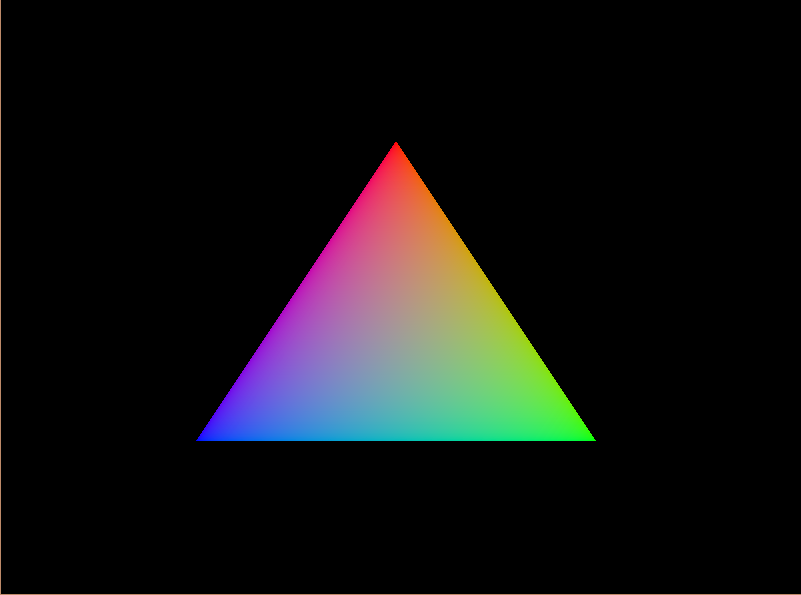

# Vulkan Initiation

This project was an initiation to modern graphics API.
I choosed to work on Vulkan.

If you open the exe, you will get into a scene with a simple object loaded and
rendered with vulkan API.

---

## Key mapping : 

- Right click on window : Capture the mouse.
- Tab : Uncapture the mouse.

Only when the mouse is captured :

- Mouse : Look arround.
- W : Go forward.
- S : Go backward.
- A : Go left.
- D : Go right.
- Space bar : Go up.
- Shift : Go down.

---

## Workings steps

The first step was to draw a basic triangle with hardcoded vertices.

Then, two indexed rectangle.

Later I put a texture on them and initialized the depth buffer to render it better.

 
And finally, the loading of the object, with all vertices parsed and stored.
Later I finised the project by working on the camera movement. I used glm's matrix.

